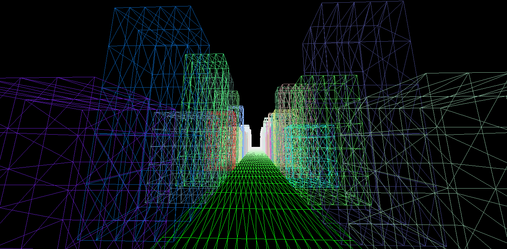
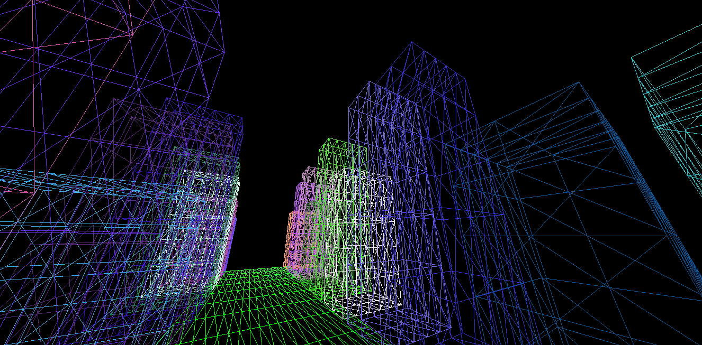

### About

This is my [three.js](https://threejs.org/) playground. Whatever I learn and practice, I share here. This is for my personal use only and I strongly recommend not following such low quality js/html codes of mine. Anyways, I'm keeping it public **just in case** it can help someone.

Test it live at **[MyProjects](http://myprojects.cf)**. (may not be up do date always)

### I've Used:

- [Three.js](https://threejs.org/)
- HTML/CSS

### How to use Three.js:

There are many ways you can use threejs in your project. Doc page of threejs has a very good tutorial on it. Here, I've used the import method and imported the **three.module.js**. Instead of downloading the threejs files (lots of files are there apart from three.js/three.min.js/three.module.js) from anywhere else, always use the ones found in the [threejs github repo](https://github.com/mrdoob/three.js). Clone the repo to your PC, and the main 3 files (of which you'll need any one) are located in the **build** directory. Other js files are available in the **example** directory.

### Some Images:

**Image 1**

**Image 2**

### Testing Website:

I upload these codes at **http://myprojects.cf**, a testbench website of mine. The website might not host the latest files always.

### What I'm making (Log):

- [27 Feb,2 2020] Trying to make some houses and streets, and implementing first person walking. Using wireframe only. Not because I don't know how to use faces and materials, but because I love wireframe. I'll move on to something new after FPS movement is perfectly implemented.
